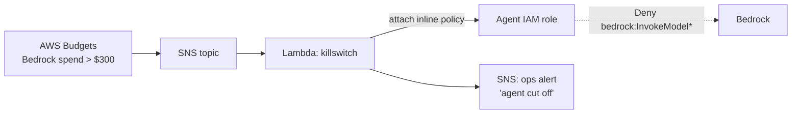

# Module 01 — Bedrock Spend Kill-Switch

**The failure mode:** an agent loops, retries, or gets prompt-injected into burning inference. Bedrock has no built-in hard spend cap — AWS Budgets only *notifies* by default. By the time a human reads the email, you've spent the month's budget overnight.

**The pattern:** turn the budget alert into an enforcement action. When Bedrock spend crosses a threshold (default **$300**), a Lambda attaches an explicit-deny policy to the agent's IAM role. Explicit deny beats every allow — the agent is cut off mid-loop, instantly.

## Architecture



## What gets deployed

| Resource | Purpose |
|---|---|
| `aws_budgets_budget` | Cost filter on Amazon Bedrock service, threshold notification at the cap |
| `aws_sns_topic` | Budget alert fan-out |
| `aws_lambda_function` | Attaches the deny policy to the target role; emits an ops alert |
| `aws_iam_policy` (deny) | `Deny` on `bedrock:InvokeModel`, `bedrock:InvokeModelWithResponseStream`, `bedrock:Converse*` |

## Run it

```bash
cd terraform
terraform init
terraform apply -var="agent_role_name=YOUR_AGENT_ROLE" -var="monthly_cap_usd=300"
# No agent yet? Use the built-in demo role instead:
terraform apply -var="create_demo_agent_role=true"
```

## See it fire (without spending $300)

```bash
cd demo && ./run-demo.sh
```

The script (1) calls Bedrock as the agent role — succeeds; (2) invokes the
kill-switch Lambda with a synthetic SNS budget event; (3) repeats the same
Bedrock call — `AccessDeniedException`. Requires `jq`. Cost: < $0.01.
In regions that require inference profiles, override the model, e.g.
`MODEL_ID=eu.anthropic.claude-haiku-4-5-20251001-v1:0 ./run-demo.sh`.

**Cost to run this demo:** ~$0. Budgets (first two free), SNS, and Lambda are all inside the free tier. The demo script that triggers a real Bedrock call costs < $0.01.

**Teardown:** `terraform destroy` (also detaches the deny policy if it fired).

## Example session

Protecting a real agent role called `my-agent-role` with a $300 monthly cap:

```bash
$ cd terraform
$ terraform init
$ terraform apply -var="agent_role_name=my-agent-role" -var="monthly_cap_usd=300"
...
Apply complete! Resources: 10 added, 0 changed, 0 destroyed.

Outputs:
agent_role_name        = "my-agent-role"
deny_policy_arn        = "arn:aws:iam::123456789012:policy/agentsec-bedrock-deny"
killswitch_lambda_name = "agentsec-bedrock-killswitch"
manual_reenable_command = "aws iam detach-role-policy --role-name my-agent-role --policy-arn arn:aws:iam::123456789012:policy/agentsec-bedrock-deny"
ops_alert_topic_arn    = "arn:aws:sns:us-east-1:123456789012:agentsec-bedrock-killswitch-fired"
```

Get alerted when it fires (email, or point it at your Slack webhook):

```bash
$ aws sns subscribe \
    --topic-arn arn:aws:sns:us-east-1:123456789012:agentsec-bedrock-killswitch-fired \
    --protocol email --notification-endpoint you@example.com
```

Prove the cut-off without spending $300 (uses a synthetic budget event):

```bash
$ cd ../demo && ./run-demo.sh
==> 1/3 Bedrock call as agent role 'my-agent-role' (should succeed)
OK

==> 2/3 Fake-firing the budget alert (synthetic SNS event -> kill-switch Lambda)
{"status": "agent disabled", "role": "my-agent-role"}

==> 3/3 Same Bedrock call again (should be DENIED)
An error occurred (AccessDeniedException) when calling the Converse operation:
User: arn:aws:sts::123456789012:assumed-role/my-agent-role/killswitch-demo
is not authorized to perform: bedrock:InvokeModel ... with an explicit deny
in an identity-based policy: arn:aws:iam::123456789012:policy/agentsec-bedrock-deny

✅ Agent cut off. Kill-switch works.
```

After investigating why spend spiked, restore access:

```bash
$ aws iam detach-role-policy --role-name my-agent-role \
    --policy-arn arn:aws:iam::123456789012:policy/agentsec-bedrock-deny
```

No agent role yet? `terraform apply -var="create_demo_agent_role=true"` creates a
throwaway `agentsec-demo-agent` role so you can try the whole flow first.

## Caveats (read before trusting your wallet to this)

- **Budgets latency:** AWS billing data lags ~8–12 hours. This is a backstop, not a real-time meter. For tighter control, pair with per-request token limits in the agent runtime.
- The deny is attached to a **named role** — agents using other roles aren't covered. Module 02 covers consolidating agent identity.
- Re-enabling is deliberately manual: detach the policy yourself once you know *why* spend spiked.
