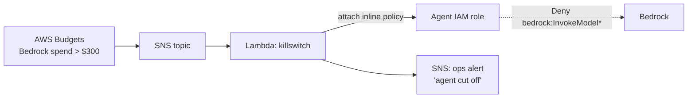

# Module 01 — Bedrock Spend Kill-Switch

**The failure mode:** an agent loops, retries, or gets prompt-injected into burning inference. Bedrock has no built-in hard spend cap — AWS Budgets only *notifies* by default. By the time a human reads the email, you've spent the month's budget overnight.

**The pattern:** turn the budget alert into an enforcement action. When Bedrock spend crosses a threshold (default **$300**), a Lambda attaches an explicit-deny policy to the agent's IAM role. Explicit deny beats every allow — the agent is cut off mid-loop, instantly.

## Architecture



## What gets deployed

| Resource | Purpose |
|---|---|
| `aws_budgets_budget` | Cost filter on Amazon Bedrock service, threshold notification at the cap |
| `aws_sns_topic` | Budget alert fan-out |
| `aws_lambda_function` | Attaches the deny policy to the target role; emits an ops alert |
| `aws_iam_policy` (deny) | `Deny` on `bedrock:InvokeModel`, `bedrock:InvokeModelWithResponseStream`, `bedrock:Converse*` |

## Run it

```bash
cd terraform
terraform init
terraform apply -var="agent_role_name=YOUR_AGENT_ROLE" -var="monthly_cap_usd=300"
```

**Cost to run this demo:** ~$0. Budgets (first two free), SNS, and Lambda are all inside the free tier. The demo script that triggers a real Bedrock call costs < $0.01.

**Teardown:** `terraform destroy` (also detaches the deny policy if it fired).

## Caveats (read before trusting your wallet to this)

- **Budgets latency:** AWS billing data lags ~8–12 hours. This is a backstop, not a real-time meter. For tighter control, pair with per-request token limits in the agent runtime.
- The deny is attached to a **named role** — agents using other roles aren't covered. Module 02 covers consolidating agent identity.
- Re-enabling is deliberately manual: detach the policy yourself once you know *why* spend spiked.
